# 1. How project is created ? #
## 1.1 Install NPM ##
```js

```

## 1.2 Install VUE CLI ##
```js
sudo npm install -g @vue/cli
```

## 1.3 Create Vue Project using CLI ##
```js
 vue create clientmgmt
```

# 2. Add Vuex #
## 2.1 Add vuex ##
```js
vue add vuex
```

# 3. Install Tailwind CSS #
```js
vue add tailwind 
```

# 4. Install AWS Amplify dependency for UI #
```js
npm install aws-amplify @aws-amplify/ui-components
```
- Reference: https://docs.amplify.aws/start/getting-started/setup/q/integration/vue/#initialize-a-new-backend
- Make sure to run command:
```js 
amplify push -y
```
to make amplify available for UI

# 5. Dependencies and virtual environment setup inside lambda function #
```python
pipenv install aws-wsgi boto3 flask flask-cors psycopg2-binary SQLAlchemy SQLAlchemy-serializer
```

## 5.2 How to install dependencies ##
1. Go inside amplify folder (cd amplify)
2. Goto function (cd function)
3. Go inside sensorlambda (cd sensorlambda)
4. Run dependencies specified inside 1

## 5.3 How to mock lambda function with Amplify ##
```python
amplify mock function sensorlambdav3
```

# 6. Architecture diagrams #
## 6.1 Current AWS cloud design ##
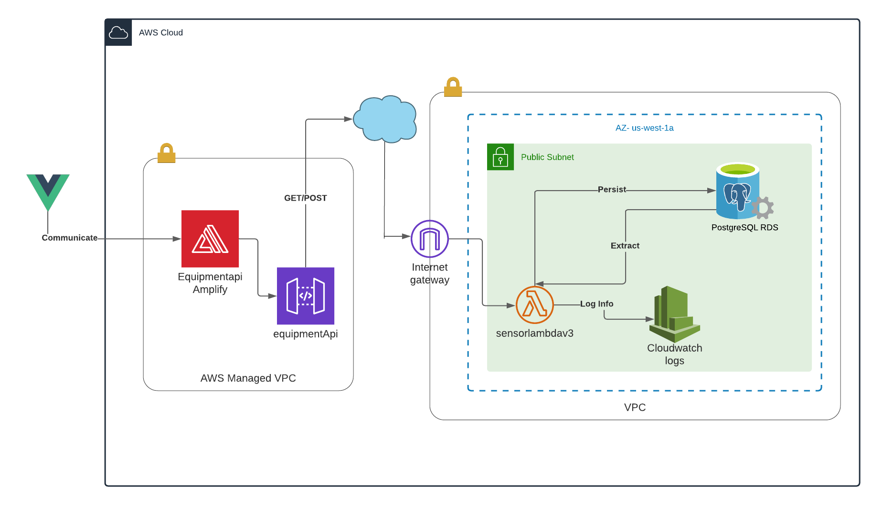

## 6.2 Alternative AWS cloud design ##
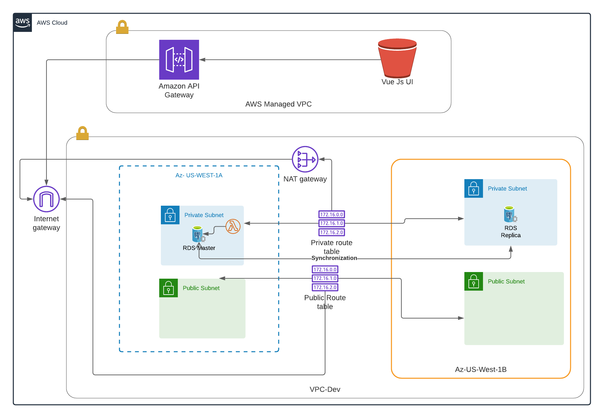

# 7. API server flow design #
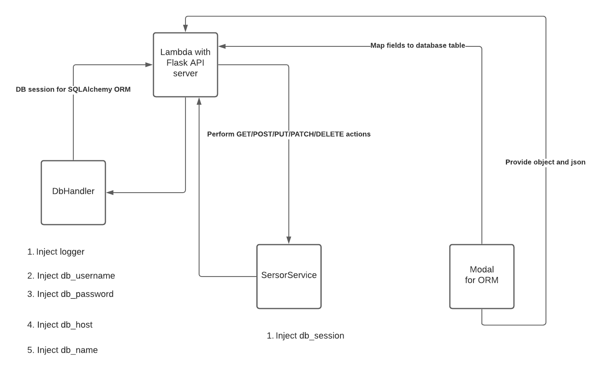

# 8. Script #
## 8.1 Database script for creating table ##
```sql
 
 1. Database/create.sql

-- Table: public.sensor

-- DROP TABLE public.sensor;

CREATE TABLE public.sensor
(
    id bigint NOT NULL DEFAULT nextval('sensor_id_seq'::regclass),
    hexid text COLLATE pg_catalog."default",
    name text COLLATE pg_catalog."default",
    temperature integer,
    location text COLLATE pg_catalog."default",
    CONSTRAINT sensor_pkey PRIMARY KEY (id)
)

TABLESPACE pg_default;

ALTER TABLE public.sensor
    OWNER to postgres;
```

## 8.2 Database script for creating primary key using sequence ##
```sql

2. Database/sequence.sql

-- SEQUENCE: public.sensor_id_seq

-- DROP SEQUENCE public.sensor_id_seq;

CREATE SEQUENCE public.sensor_id_seq
    INCREMENT 1
    START 1
    MINVALUE 1
    MAXVALUE 2147483647
    CACHE 1;

ALTER SEQUENCE public.sensor_id_seq
    OWNER TO postgres;
```

## 8.3 Lambda function with Flask server and PostGres ##
```python

4. amplify/backend/function/sensorlambdav3/src/index.py

from modal.sensor import Sensor
from sensorservice import SensorService
from dbhandler import DbHandler

import awsgi
import json
import logging
from os import error
import os

from flask_cors import CORS
from flask import Flask, app, jsonify, request


BASE_ROUTE ="/sensorsv3"

app = Flask(__name__)
CORS(app)

logger = logging.getLogger()

@app.route(BASE_ROUTE, methods=['POST'])
def create_customer():
    try:
        """
            PRODUCTION REQUEST VALUE
        """
        request_json = request.get_json()
        request_hex_id = request_json.get('hexid')
        request_name = request_json.get('name')
        request_temperature = request_json.get('temperature')
        request_location = request_json.get('location')

        """
            LOCAL TESTING
        """
        #request_hex_id = '0x123'
        #request_name = 'test name'
        #request_temperature = 15
        #request_location = 'Surrey'
    
        db_session = provide_database_session()
        sensor_service = SensorService(db_session)
        sensor_service.save_sensor(Sensor(name=request_name,hexid=request_hex_id,temperature=request_temperature, location =request_location))
    
        return jsonify(message='OK')
    except error as e:
         logger.critical(e)
         return jsonify(message='FAILED')
    

@app.route(BASE_ROUTE, methods=['GET'])
def list_customer():
    db_session = provide_database_session();

    # todo make list to json
    sensor_list =[]
    sensor_service = SensorService(db_session)
    sensors = sensor_service.get_sensor()
    for sensor in sensors:
        sensor_list.append(sensor.get_json)
    return sensor_list

def handler(event, context):
  logger.info('received event:')
  logger.info(event)
  return awsgi.response(app,event,context)

def provide_database_session():
    
    """ 
        PRODUCTION
    """
    dbusername = validate_db_username(os.environ.get("DB_USERNAME"))
    dbpassword = validate_db_password(os.environ.get("DB_PASSWORD"))
    dbhost = validate_db_host(os.environ.get("DB_HOST"))
    dbname = validate_db_name(os.environ.get("DB_NAME"))

    """
        LOCAL TESTING
    """
    #dbusername = validate_db_username('postgres')
    #dbpassword = validate_db_password('<Password>')
    #dbhost = validate_db_host('<I have terminated RDS>')
    #dbname = validate_db_name('postgres')

    dbhandler = DbHandler(logger,dbusername, dbpassword, dbhost , dbname)
    return dbhandler.get_orm_db_session()


def validate_db_username(username):
    if username != None:
        return username
    else:
        logger.critical("UNABLE TO GET DB USERNAME FROM ENVIRONMENT CONFIG")

def validate_db_password(password):
    if password != None:
        return password
    else:
        logger.critical("UNABLE TO GET DB PASSWORD FROM ENVIRONMENT CONFIG")

def validate_db_host(host):
    if host != None:
        return host
    else:
        logger.critical("UNABLE TO GET DB HOSTNAME FROM ENVIRONMENT CONFIG")

def validate_db_name(name):
    if name != None:
        return name
    else:
        logger.critical("UNABLE TO GET DB NAME FROM ENVIRONMENT CONFIG")
```

```python

4. amplify/backend/function/sensorlambdav3/src/sensorservice.py

from modal.sensor import Sensor
from sqlalchemy.orm.session import Session


class SensorService():

    def __init__(self, db_session):
        self.__db_session=db_session
    
    def save_sensor(self, sensor):
        self.__db_session.add(sensor)
        self.__db_session.commit()
        self.__db_session.flush()

    def get_sensor(self):
        return self.__db_session.query(Sensor).all()

    def get_sensor_by_id(self,id):
        return self.__db_session.query(Sensor).filter(Sensor.id == id).all()
```

```python

5. amplify/backend/function/sensorlambdav3/src/modal/sensor.py

from sqlalchemy import (
    Column,
    Text,
    Integer,
    Enum,
    BigInteger
)
from sqlalchemy.dialects.postgresql import UUID
from sqlalchemy.ext.declarative import declarative_base
from sqlalchemy.schema import MetaData
import logging

logging.basicConfig()
logging.getLogger('sqlalchemy.engine').setLevel(logging.WARNING)

NAMING_CONVENTION = {
    "ix": "ix_%(column_0_label)s",
    "uq": "uq_%(table_name)s_%(column_0_name)s",
    "ck": "ck_%(table_name)s_%(constraint_name)s",
    "fk": "fk_%(table_name)s_%(column_0_name)s_%(referred_table_name)s",
    "pk": "pk_%(table_name)s"
}

metadata = MetaData(naming_convention=NAMING_CONVENTION)
Base = declarative_base()

class Sensor(Base):
    __tablename__ = 'sensor'
    id = Column('id',BigInteger, primary_key=True, unique=True, nullable=False)
    name = Column('name', Text, nullable=True)
    hexid = Column('hexid', Text, nullable=True)
    temperature = Column('temperature', Integer, nullable=True)
    location =  Column('location', Text, nullable=True)

```

```python 

6. amplify/backend/function/sensorlambdav3/src/dbhandler.py

from os import error
from sqlalchemy import create_engine
from sqlalchemy.orm import sessionmaker

class DbHandler():

    def __init__(self, logger, db_username, db_password, db_host, db_name):
        self.__logger =logger
        self.__db_username =db_username
        self.__db_password =db_password
        self.__db_host= db_host
        self.__db_name = db_name
    
    def get_orm_db_session(self):
        try:
            postgres_engine = create_engine(f'postgresql://{self.__db_username}:{self.__db_password}@{self.__db_host}:5432/{self.__db_name}')
            session = sessionmaker(bind=postgres_engine)()
            return session;
        except error as e:
            self.__logger.critical(e)
    
```

```python

6. amplify/backend/function/sensorlambdav3/src/Pipfile.lock

[[source]]
name = "pypi"
url = "https://pypi.org/simple"
verify_ssl = true

[dev-packages]

[packages]
src = {editable = true, path = "./src"}
aws-wsgi = "*"
boto3 = "*"
flask = "*"
flask-cors = "*"
psycopg2-binary = "*"
sqlalchemy = "*"

[requires]
python_version = "3.8"
```

```js

6. amplify/backend/function/sensorlambdav3/src/event.json

{ "httpMethod": "POST", "path":"/sensorsv3","queryStringParameters":""}

```

# 8. Snapshots #
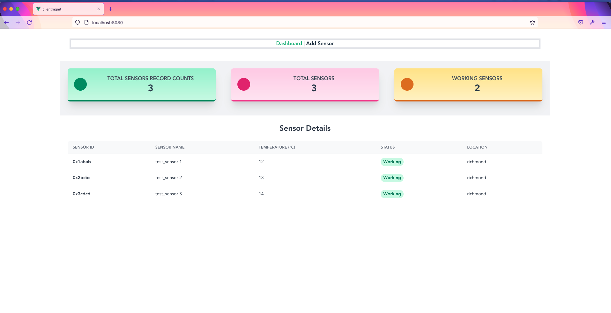
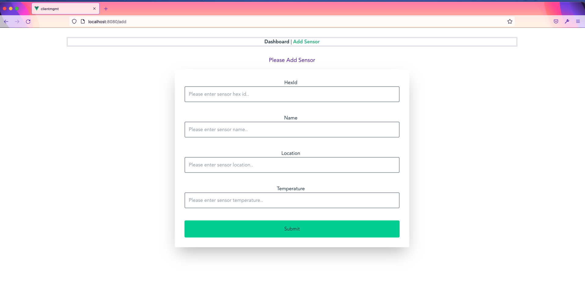

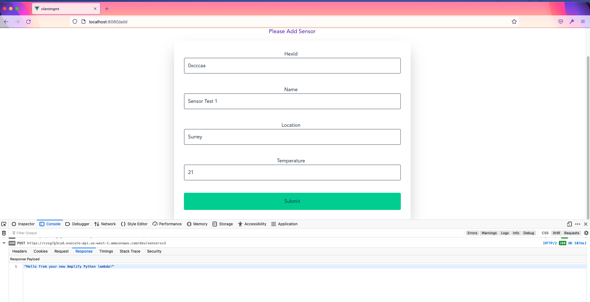
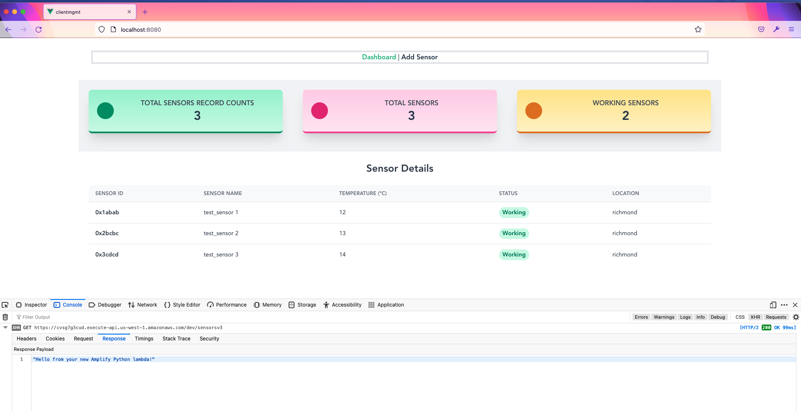
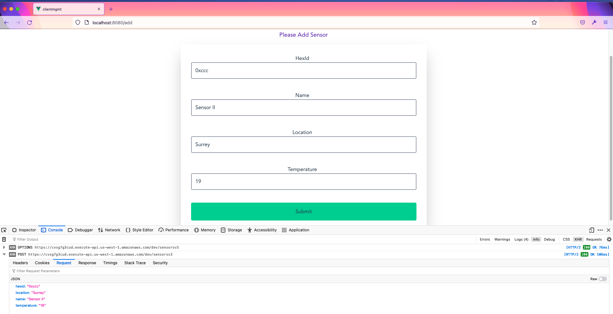

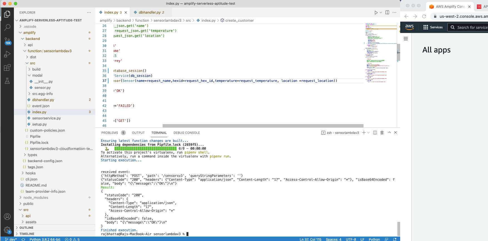
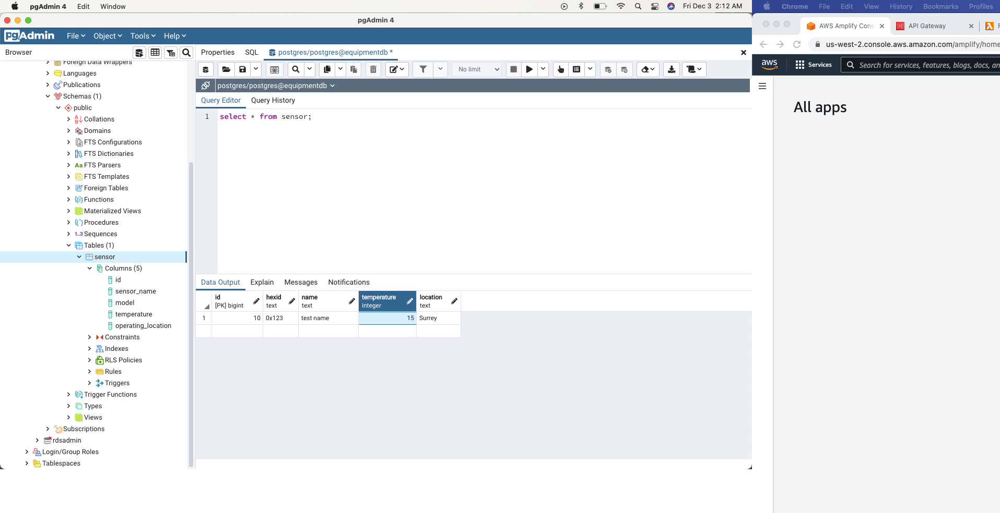
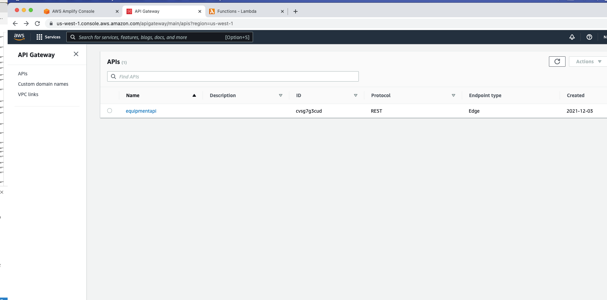
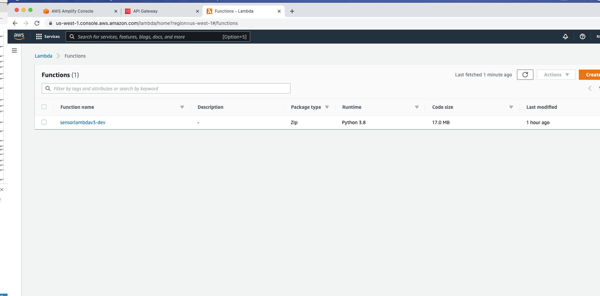
